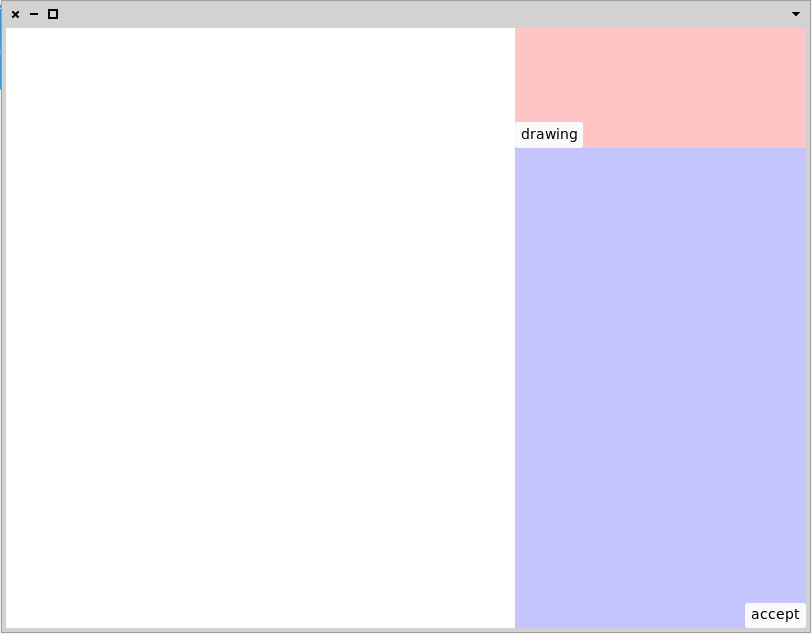

Aod is a prototype vector editor in Pharo, with support for linear constraints.


To load this project in Pharo7, run the following script in Playground. 

(Preferably, use a fresh image to ensure things go smoothly. Also, try to avoid the 32bit version on Linux, as in that case, Bloc has to use an alternative, not as optimized drawing backend.)
```
Metacello new 
	baseline: 'Aod';
	repository: 'gitlab://gitlab.fit.cvut.cz:balikvo1/aod';
	load
```

If you have any problems, please open an issue or constact me at [balikvo1@fit.cvut.cz](url).

For a quick test if everything loaded correctly, execute the following in Playground.
```
AodElement openOn: AodDrawing new
```
An empty editor window should be opened.


